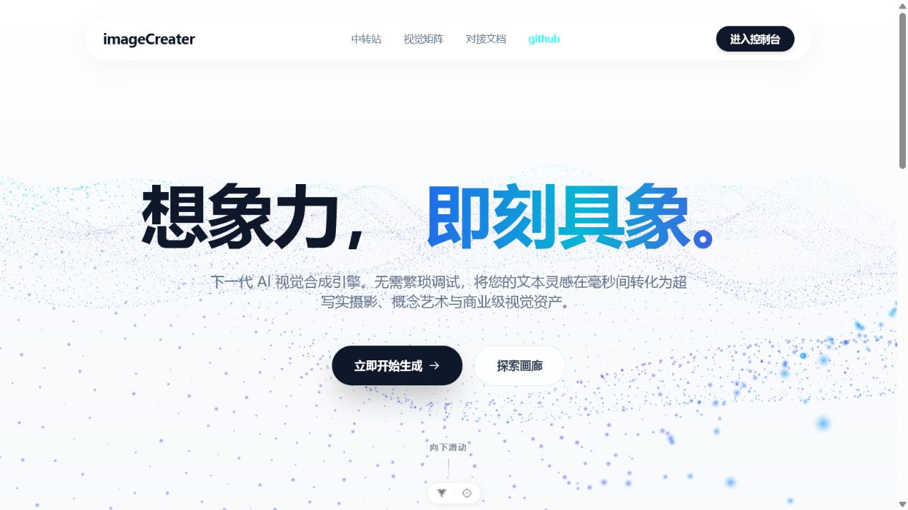
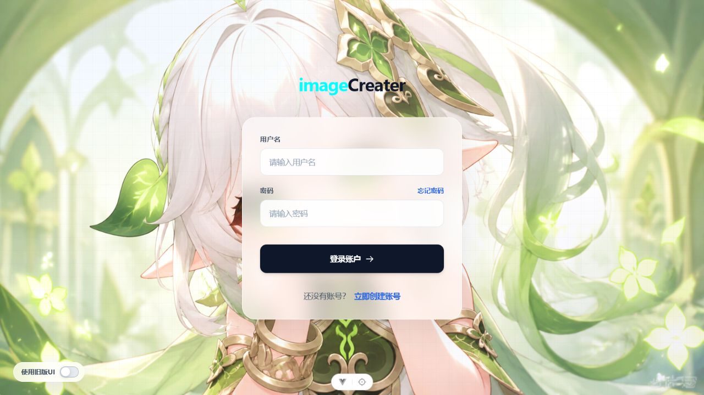
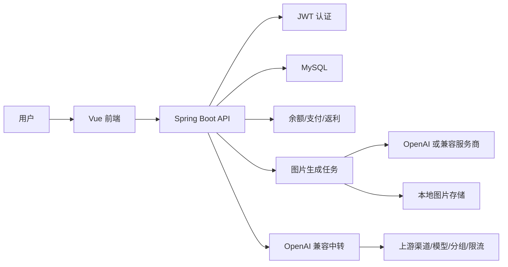

# imageCreater 项目介绍：从 AI 生图工具到 OpenAI 兼容中转平台

imageCreater 是一个围绕 AI 图像生成搭建的全栈项目。它不只是一个“输入提示词、得到图片”的前端页面，而是把用户体系、余额扣费、生成记录、充值支付、邀请返利、后台管理、模型价格配置，以及 OpenAI 兼容 API 中转能力整合到了一套完整的平台里。

项目整体采用前后端分离架构：前端负责创作体验、用户中心和后台操作台，后端负责认证、计费、图片生成任务、文件落盘、数据统计和模型中转调度。

## 前端页面效果

首页采用轻量、干净的视觉风格，核心区域通过 Three.js 背景增强科技感，同时保留清晰的入口按钮，引导用户进入创作或控制台。



首页下方展示 AI 图像作品矩阵，用 Bento Grid 的方式突出项目的视觉生成能力。


登录页承担用户体系入口，配合后端 JWT 认证完成用户态管理。



## 项目定位

这个项目的核心定位可以分成两层：

1. 面向普通用户的 AI 图片创作平台  
用户可以注册登录、充值余额、选择不同生成规格、输入提示词、上传参考图、查看生成进度、预览与删除历史作品。

2. 面向开发者和管理员的 AI 能力中转平台  
管理员可以配置上游渠道、模型、分组、价格、限流规则；用户可以创建中转 Token，把平台作为 OpenAI Base URL 使用。

这让 imageCreater 从单一生图 Demo 变成了一个更接近商业化平台的产品雏形。

## 技术栈

前端技术栈：

- Vue 3：构建组件化页面。
- TypeScript：增强类型约束，降低接口联调风险。
- Vite：提供快速开发和构建能力。
- Pinia：管理登录态、用户信息等全局状态。
- Vue Router：管理门户页、用户页和后台页路由。
- Tailwind CSS：快速实现统一、响应式的界面样式。
- Three.js：实现首页 3D 粒子背景。
- Axios：封装前后端 API 请求。

后端技术栈：

- Spring Boot 3.3.5：后端主框架。
- Spring Security + JWT：实现认证与权限控制。
- MyBatis-Plus：简化数据库 CRUD 和分页查询。
- MySQL：保存用户、订单、图片记录、渠道、模型、日志等核心数据。
- Spring AI OpenAI：接入 OpenAI 相关能力。
- Spring Mail：支持邮箱验证码和邮件配置。
- Maven Wrapper：降低后端构建环境依赖。

## 系统架构

项目目录大致分为前端 `src/` 和后端 `backend/` 两块：

```text
imageCreater
├── src/                 # Vue 前端
│   ├── api/             # Axios API 封装
│   ├── components/      # 公共组件
│   ├── router/          # 页面路由
│   ├── store/           # Pinia 状态
│   └── views/           # 首页、用户端、后台页
├── backend/             # Spring Boot 后端
│   ├── controller/      # HTTP 接口
│   ├── service/         # 业务逻辑
│   ├── mapper/          # MyBatis-Plus Mapper
│   ├── entity/          # 数据库实体
│   ├── dto/             # 请求与响应 DTO
│   └── resources/db/    # schema.sql 数据库脚本
└── docs/images/         # 博客截图资源
```

核心调用链如下：



## 核心功能

### 1. AI 图片生成

图片生成是项目的主流程。前端页面支持：

- 输入提示词。
- 选择生成规格。
- 设置自动尺寸、比例尺寸或自定义宽高。
- 上传最多 4 张参考图。
- 查看生成耗时估计和生成状态。
- 查看最近作品、失败原因、预览、删除、复用提示词。

后端的 `ImageServiceImpl` 负责提交任务、扣除余额、调用上游图片接口、保存返回图片，并记录生成耗时。任务状态使用 `pending`、`success`、`failed` 区分，前端通过轮询详情接口刷新结果。

比较关键的一点是：生成失败后，后端会尝试退回本次扣除的余额，避免用户因为上游接口错误而损失余额。

### 2. 用户体系与权限

项目使用 JWT 做登录态。前端 Pinia Store 保存 Token 和用户信息，路由守卫根据登录状态和角色控制访问：

- 未登录用户访问 `/create`、`/user/*`、`/admin/*` 会跳转登录页。
- 普通用户不能进入管理员页面。
- 管理员登录后可进入后台仪表盘。

这种设计让用户端和管理端共用一套前端应用，同时通过角色区分操作权限。

### 3. 余额、充值与扣费

图片生成不是无成本操作，所以项目引入余额体系：

- 用户生成图片前扣除对应规格价格。
- 后台可配置不同生成规格、模型、服务商地址、API Key、价格和启用状态。
- 充值记录、支付配置和余额变化都通过后端统一管理。

这部分是平台商业化的基础。

### 4. 邀请返利

项目还实现了邀请返利链路：

- 用户拥有邀请码。
- 新用户注册时可绑定邀请人。
- 被邀请用户充值后可产生返利记录。
- 后台可以审核返利和提现申请。
- 用户可配置提现二维码。

这让平台具备基础增长和分销能力。

### 5. OpenAI 兼容 API 中转

除了图片生成页面，项目还提供了兼容 OpenAI 风格的中转接口，例如：

```text
GET  /api/v1/models
POST /api/v1/chat/completions
POST /api/v1/responses
POST /api/v1/completions
POST /api/v1/embeddings
POST /api/v1/images/generations
POST /api/v1/images/edits
POST /api/v1/audio/transcriptions
POST /api/v1/audio/translations
POST /api/v1/audio/speech
```

中转模块的关键点包括：

- 用户创建自己的访问 Token。
- 管理员配置上游渠道、模型、分组和价格。
- 支持 RPM、TPM、并发数、IP 白名单等限制。
- 根据优先级、权重、分组和可用模型进行调度。
- 记录请求日志、Token 用量和成本。
- 对部分 Anthropic 风格请求做兼容处理。

这部分让项目具备“AI API 网关”的能力，不再局限于单一图片生成场景。

## 后台管理能力

后台页面覆盖了平台运行所需的大部分配置项：

- 管理仪表盘：查看平台数据概况。
- 用户管理：用户角色、余额、封禁等操作。
- 生图配置：配置模型、价格、尺寸、API Key 和服务商地址。
- 中转管理：配置渠道、模型、分组、Token、用量和策略。
- 支付配置：管理充值支付参数。
- 邮件配置：管理 SMTP 和验证码发送。
- 公告管理：发布平台公告。
- 邀请返利：审核返利和提现。
- 系统日志：查看生成记录和错误信息。

这些功能让项目从“能跑”逐步过渡到“可运营”。

## 关键实现点

### 异步生成与状态轮询

图片生成可能耗时较长，如果同步阻塞请求，用户体验和服务稳定性都会变差。项目后端在提交任务后先创建图片记录并返回，随后通过执行器异步请求上游服务。前端拿到记录 ID 后定时查询状态，直到成功或失败。

这种方式的好处是：

- 前端能及时展示“正在生成”状态。
- 后端可以记录任务耗时和失败原因。
- 失败后可以统一退款。
- 后续也方便扩展为队列或任务中心。

### 生图配置抽象

后台将生图规格抽象为 `ImageGenerationConfig`，其中包含：

- 规格编码。
- 展示名称。
- API Base URL。
- Endpoint Path。
- API Key。
- 模型名称。
- 尺寸。
- 质量参数。
- 用户扣费价格。
- 是否启用。
- 排序。

这样做的意义是：不需要改代码就能切换服务商、模型、价格和规格。

### 中转渠道调度

中转模块把渠道、模型、分组、Token 拆开管理：

- 渠道负责连接上游服务商。
- 模型负责对外暴露模型名称和价格。
- 分组负责控制用户可访问的模型范围和倍率。
- Token 负责用户级访问凭证、额度和限流。

这种拆分让系统能够支持多个服务商、多模型、多用户、多价格策略。

### 错误信息沉淀

图片生成和中转请求都可能遇到 401、429、503、524 等上游错误。项目后端会保存状态码、错误类型、请求地址和可读错误信息，前端也提供失败原因弹窗。

这对排查问题很重要，尤其是涉及第三方模型服务时，不能只给用户一个笼统的“生成失败”。

## 完善进程

项目已经具备的能力：

- 完成 Vue 3 前端基础页面。
- 完成用户注册、登录、JWT 鉴权。
- 完成 AI 图片生成主流程。
- 完成生成历史、图片预览、删除和失败原因查看。
- 完成余额扣费、失败退款和充值记录。
- 完成后台生图配置。
- 完成公告、邮件、支付、用户管理。
- 完成邀请返利和提现审核流程。
- 完成 OpenAI 兼容中转接口。
- 完成渠道、模型、分组、Token、用量统计等中转管理能力。

正在继续完善或适合继续完善的方向：

- 优化 README 和前端中文文案的编码问题，保证开源文档可读性。
- 增加更完整的自动化测试，覆盖余额扣费、退款、中转限流和权限判断。
- 将图片生成任务从线程池升级为消息队列，提升高并发稳定性。
- 增加对象存储支持，例如 MinIO、S3、OSS，避免只依赖本地文件。
- 增加后台数据可视化图表，展示收入、消耗、模型调用趋势。
- 增加更细的审计日志，记录管理员关键操作。
- 增加 Docker Compose，一键启动 MySQL、后端和前端。
- 优化移动端创作页面体验。

## 部署要点

本地开发需要：

- Node.js 20.19+ 或 22.12+
- JDK 17+
- MySQL 8+
- Maven Wrapper

前端启动：

```sh
npm install
npm run dev
```

后端启动：

```sh
cd backend
cmd /c mvnw.cmd spring-boot:run
```

生产环境需要重点检查：

- 修改默认管理员密码。
- 设置强 `JWT_SECRET`。
- 配置真实 MySQL 账号和密码。
- 配置真实 SMTP 服务。
- 配置可用的 OpenAI 或兼容服务商 API Key。
- 确认图片上传目录是持久化目录。
- 使用 Nginx 反向代理前端静态资源和后端接口。
- 数据库升级前先备份。

## 总结

imageCreater 的价值在于，它把 AI 生图、用户计费、后台运营和模型中转放进了同一个项目中。前端关注创作体验，后端关注任务、计费、权限和调度，后台则负责把平台能力配置化。

从技术实现上看，这个项目已经不是简单的 API 调用 Demo，而是一个具备产品闭环的 AI 应用平台。后续如果继续补齐测试、部署、对象存储、队列和监控能力，它可以进一步演进成更稳定的生产级 AI 创作与 API 中转系统。
